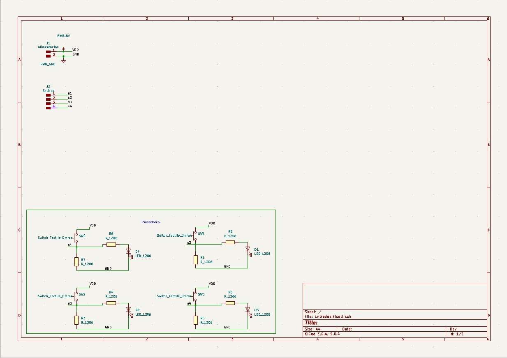
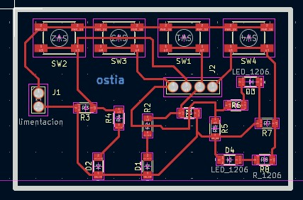
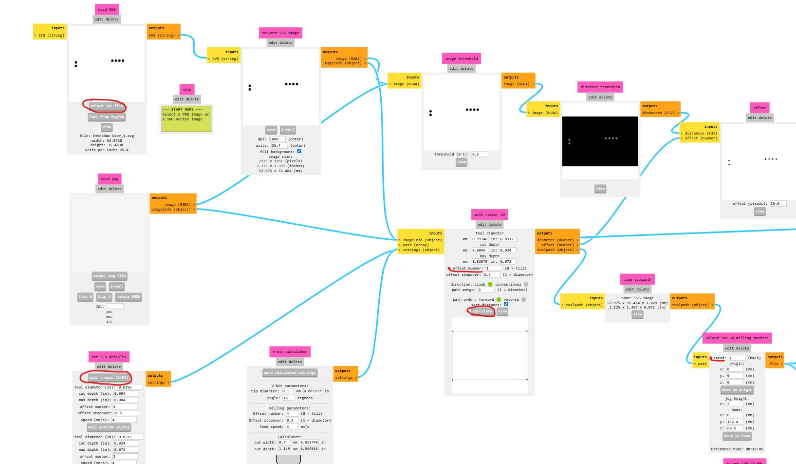
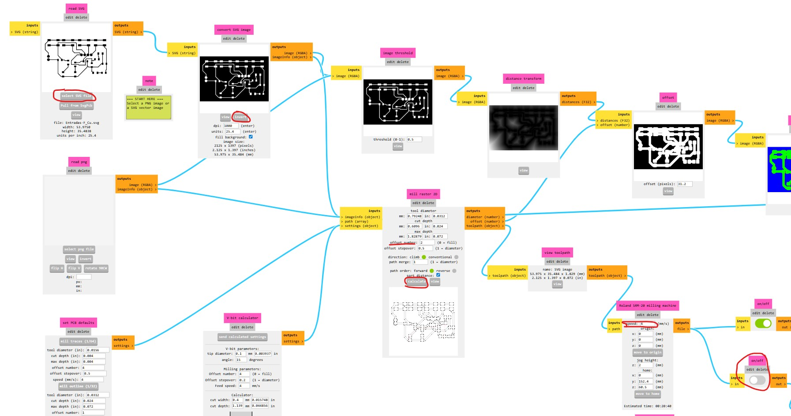
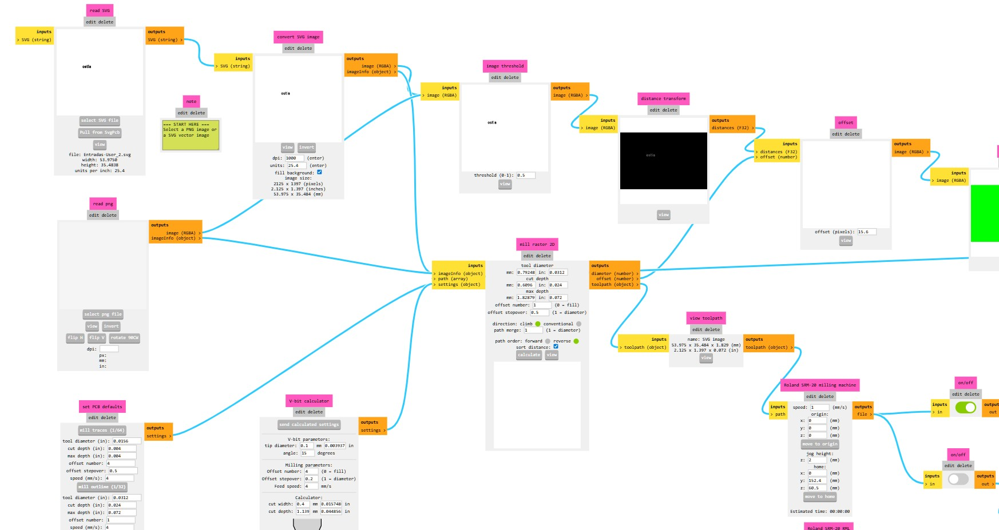
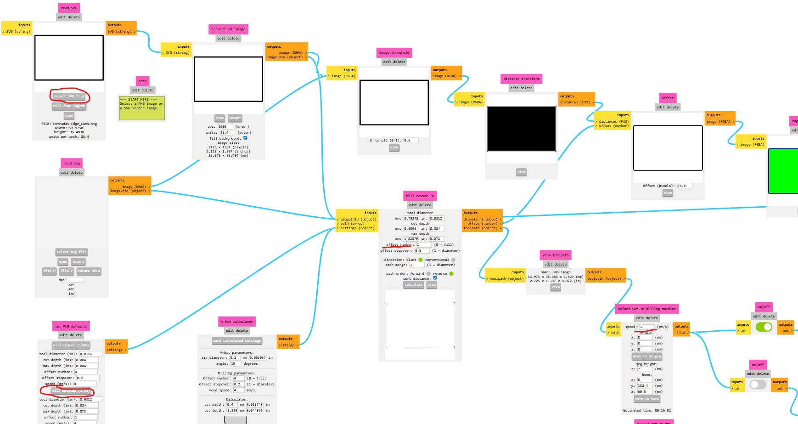
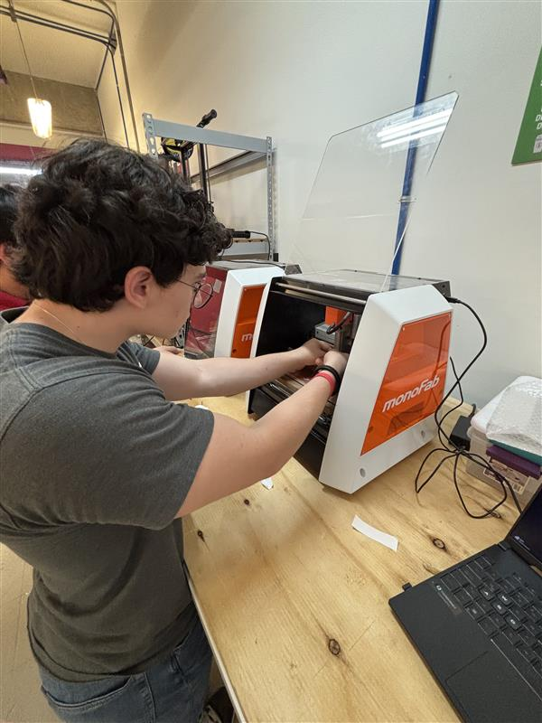
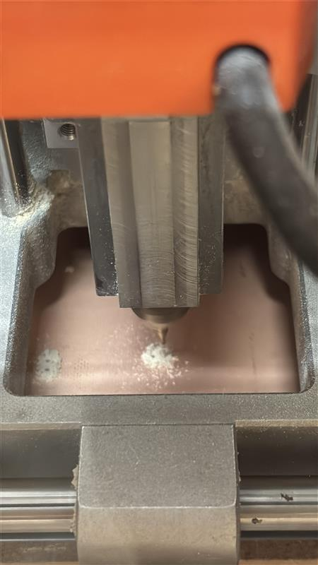
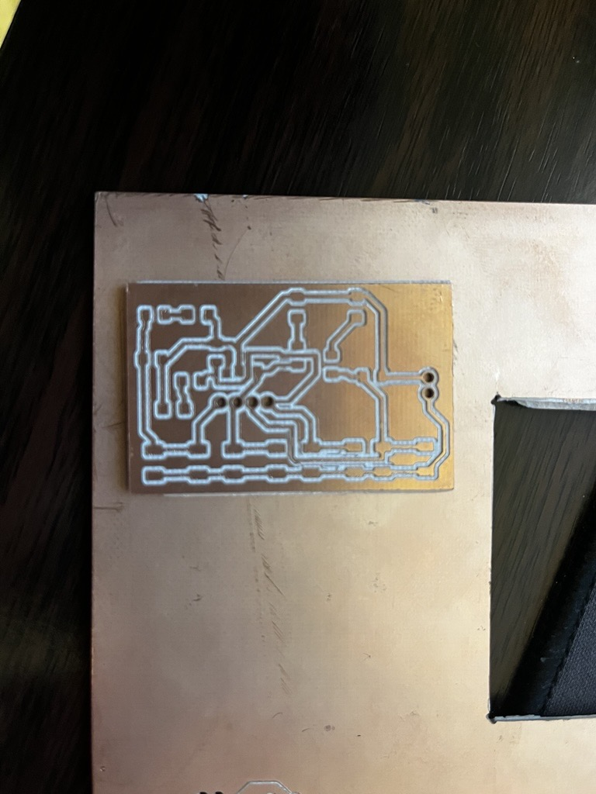

# 📚 Página WEB

> Plantilla genérica para documentar proyectos académicos o de ingeniería.  
> Copia y adapta las secciones según tu necesidad.

---

## 1) Resumen

- **Nombre del proyecto:** _PBC con MonoFab_  
- **Equipo / Autor(es):** _Solórzano Herrera Sebastian y Bermudez Ruiz Uriel Onairam_  
- **Curso / Asignatura:** _Electrónica Digital_  
- **Fecha:** _18/09/2025_  
- **Descripción breve:** _Realizamos una PCB con una placa fenolica, utilizando la MonoFab y el modelaje el Kikad._

!!! tip "Consejo"
    Mantén este resumen corto (máx. 5 líneas). Lo demás va en secciones específicas.

---

## 2) Objetivos

- **General:** _Diseñar una PBC utilizando la MonoFab._
- **Específicos:**
  - _Aprender los recursos básicos de Kikad para el diseño y la construcción._
  - _Aprender el software de la MonoFab._
  - _Aprender a utilizar la MonoFab con los métodos prácticos necesarios._

## 3) Kikad: Esquemático y Diseño de la PBC

- **Esquemático:** 
_El esquemático de la PBC cuenta con 4 diferentes módulos de pulsadores, estos están compuestos de 1 pulsador **Switch_Tactile_Dmor**, 2 resistencias **R_1206** y un led **LED_1206**. Todo esto esta alimentado con un voltaje menor a 5 volts y tiene 4 salidas._

- **Diseño de la PBC:** 
_Para la realización del diseño de la PBC, utilizamos un diseño de **53mm x 33** esto para que no nos hiciera falta espacio, ni tampoco sobraba demás. Utilizamos unas **pistas de línea de 0,4mm** y un contorno de **1mm**._
_Utilizamos 4 capas, las cuales se divien en:_ 
- F.Cu **Pistas:**
    * Aquí colocamos las pistas en donde se hará el trazado a 0.4mm.
- Edge.Cuts **Borde:** 
    - Aquí colocamos el borde en donde cortaremos la placa con un grueso de 1mm.
- User.1 **Perforaciones:** 
    - Aquí colocamos las perforaciones que se harán en nuestra placa para colocar fuestras entradas y salidas.
- User.2 **Estampados** 
    - Aquí colocamos los grabados extras que le darán la estética a nuestra placa.

---

## 4) Uso de Mods

**Perforaciones:**
- _Para la configuración de la maquina es necesario iniciar con las **perforaciones**, ya que son las más rápidas durante este proceso.Para la configuración de este proceso es necesario cargar el archivo descargado y colocar los valores estandar de la PCB **mill traces (1/64)** y colocar un offset de 1, con una velocidad de **4mm/s**._ 

**Pistas:**
- _Para la creación de pistas es necesario **invertir** el diseño, seleccionar un **offset de 2** y una velocidad de **4mm/s**. Para descargar los archivos, es necesario encender el **output** y **calcular** el diseño._

**Estampados:**
- _Para poder generar un grabado es necesario descargar un png de una **imagen vectorial** o diseñar una, esta te permite colocarla directamente en el KiKad para crear un nuevo borde o hacer un grabado dentro la placa para conocer las entradas o salidas, etc._

**Borde:**
- _Para generar el borde es necesario cambiar la configuración de la PBC a los **valores originales**. Además de modifiacar el offset a **1** para que no demasiadas trazos y que tenga una velocidad moderada de **1mm/s**._
_

---

## 5) Instalación

